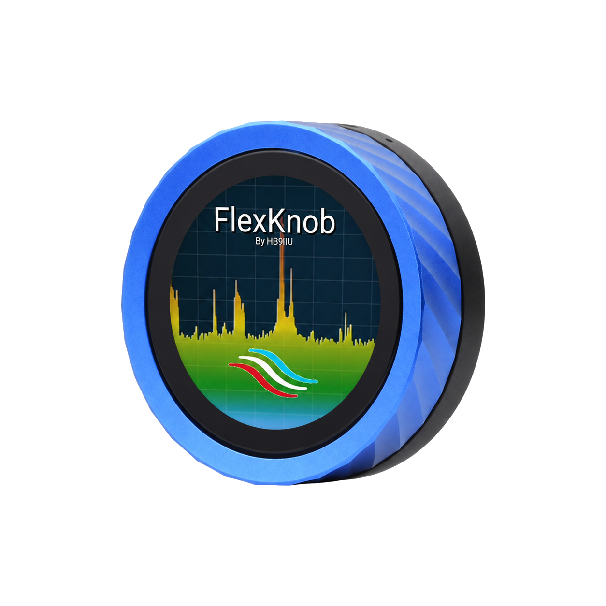

# FlexKnob

  

A round rotary HMI controller for FlexRadio SDR transceivers, built on the Waveshare ESP32-S3 Knob Touch LCD 1.8". Tune, switch bands/modes, adjust filter/audio/tune power, and manage memories — all from a dedicated physical knob, over LAN or SmartLink WAN.

  <a href="https://flexknob.hb9iiu.com"><h2>⚡ Flash it now → flexknob.hb9iiu.com ⚡</h2></a>

This repo hosts the public firmware binaries and update manifests consumed by the device's OTA updater and by the web flasher above. It's not the source code repo.
